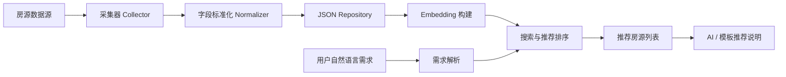
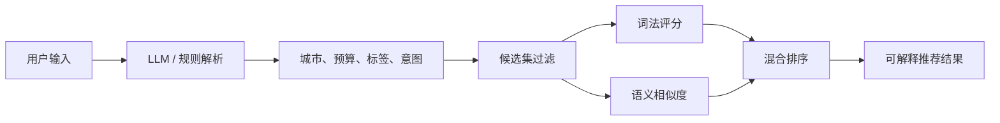

# rental-mini-program

智能租房小程序服务项目，围绕租房 / 购房场景提供房源数据采集、字段标准化、自然语言需求解析、混合推荐排序、AI 推荐说明、评价收藏和推荐历史等能力。

当前仓库已经将主程序结构外露到根目录，进入仓库后可以直接看到核心服务模块，而不是只看到前后端两个文件夹。

- `app/`：核心业务代码，包括采集、清洗、推荐算法、LLM 调用和 API 编排。
- `docs/`：项目文档，包括架构说明和接口说明。
- `frontend/`：前端侧服务目录，可用于小程序联调或后续迁移为真正的小程序端工程。
- `storage/`：运行期数据目录，开源仓库仅保留 `.gitkeep`。
- `server.py`：服务启动入口。
- `requirements.txt`：Python 依赖。
- `local.env.example`：本地配置示例。

## Highlights

| Capability | Description |
|---|---|
| 数据采集 | 支持采集器注册机制，当前包含本地样例源和链家移动站推荐流采集源。 |
| 数据标准化 | 将不同来源房源统一清洗为标准 `House` 模型，便于检索、推荐和展示。 |
| 智能推荐 | 支持自然语言需求解析、结构化过滤、词法评分、向量相似度和混合排序。 |
| 向量检索 | 支持 Ollama embedding，本地不可用时自动回退到 hash embedding。 |
| AI 说明 | 可调用 OpenAI 兼容接口生成推荐说明，失败时自动降级为模板说明。 |
| 用户服务 | 提供房源列表、详情、评价、收藏、推荐历史和采集记录等接口。 |
| 轻量部署 | 使用 JSON 文件仓库存储运行数据，适合课程设计、原型验证和小规模演示。 |

## Project Structure

```text
rental-mini-program
|-- app
|   |-- collectors.py          # 数据采集器
|   |-- normalizers.py         # 字段清洗与向量文本构建
|   |-- repositories.py        # JSON 文件仓库
|   |-- demand_parser.py       # 自然语言需求解析
|   |-- embeddings.py          # 向量化服务
|   |-- search.py              # 过滤、评分与推荐排序
|   |-- answer_generator.py    # 推荐说明生成
|   |-- services.py            # 业务服务编排
|   |-- fastapi_app.py         # FastAPI 接口层
|   `-- http_app.py            # 标准库 HTTP 接口层
|-- docs                       # 说明文档
|-- frontend                   # 前端侧服务目录
|-- storage                    # 运行期数据目录，仅保留 .gitkeep
|-- server.py                  # 服务启动入口
|-- requirements.txt           # Python 依赖
|-- local.env.example          # 环境变量示例
`-- README.md
```

## Architecture



## Recommendation Flow



## API Overview

| Method | Endpoint | Description |
|---|---|---|
| GET | `/health` | 服务健康检查，返回数据源、向量模型、LLM 和数据状态。 |
| GET | `/api/houses` | 查询房源列表，支持分类、关键词、城市和分页。 |
| GET | `/api/houses/{id}` | 查询单套房源详情。 |
| GET | `/api/reviews` | 查询评价列表。 |
| POST | `/api/reviews` | 新增房源评价。 |
| POST | `/api/search` | 自然语言房源搜索与智能推荐。 |
| POST | `/api/ai/recommend` | AI 推荐接口，与搜索推荐共用业务逻辑。 |
| GET | `/api/ai/history` | 查询 AI 推荐历史。 |
| POST | `/api/ai/history` | 保存 AI 推荐历史。 |
| GET | `/api/favorites` | 查询收藏房源。 |
| POST | `/api/favorites` | 新增收藏。 |
| DELETE | `/api/favorites/{houseId}` | 取消收藏。 |
| POST | `/api/ingest/crawl` | 触发房源数据采集。 |
| POST | `/api/ingest/embed` | 重建房源向量。 |
| GET | `/api/collections` | 查询采集运行记录。 |

## Quick Start

安装依赖：

```powershell
python -m pip install -r requirements.txt
```

启动服务：

```powershell
python server.py
```

默认监听地址：

```text
http://127.0.0.1:5000
```

访问健康检查：

```powershell
Invoke-WebRequest http://127.0.0.1:5000/health
```

## Configuration

项目不会提交真实 `local.env`。如需配置云端 LLM 或本地 embedding 服务，可以复制示例文件：

```powershell
Copy-Item local.env.example local.env
```

常用配置项：

| Variable | Description |
|---|---|
| `ANJU_LLM_BASE_URL` | OpenAI 兼容 LLM 接口地址。 |
| `ANJU_LLM_API_KEY` | LLM API Key。 |
| `ANJU_LLM_MODEL` | LLM 模型名称。 |
| `ANJU_LLM_TIMEOUT` | LLM 请求超时时间。 |
| `ANJU_EMBEDDING_PROVIDER` | 向量服务提供方，支持 `auto`、`hash`、`ollama`。 |
| `ANJU_EMBEDDING_MODEL` | Ollama embedding 模型名称。 |
| `ANJU_OLLAMA_BASE_URL` | Ollama 服务地址。 |
| `ANJU_OLLAMA_TIMEOUT` | Ollama 请求超时时间。 |

## Repository Hygiene

仓库已排除以下本地文件：

- 虚拟环境：`.venv/`
- Python 缓存：`__pycache__/`
- 本地密钥配置：`local.env`
- 运行日志：`.tmp/`、`*.log`
- 运行期数据：`storage/*.json`
- 本地工具目录：`.agents/`

`storage/` 目录仅通过 `.gitkeep` 保留空目录结构，避免上传本地采集数据或测试数据。

## Roadmap

- 接入真实小程序页面工程。
- 将 JSON 文件仓库升级为 SQLite / MySQL / PostgreSQL。
- 增加地图选房、通勤时间、用户画像和行为反馈。
- 使用 FAISS / Milvus / Qdrant 等向量数据库优化大规模语义检索。
- 完善采集器的合规控制、失败重试和数据质量校验。
