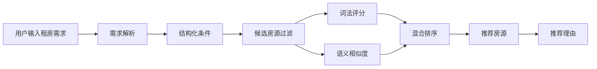
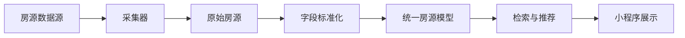

# rental-mini-program

面向租房场景的微信小程序项目，围绕房源展示、用户需求理解、智能推荐、评价收藏和推荐历史等功能进行设计与实现。项目以课程设计、功能展示和技术说明为主要目标。

## Project Overview

该项目面向租房与购房辅助决策场景，核心思路是将房源数据、用户自然语言需求和推荐算法结合起来，为用户提供更直观的房源筛选与推荐体验。

主要能力包括：

- 房源信息展示与详情查看。
- 用户评价、收藏和历史记录管理。
- 房源数据采集与字段标准化。
- 自然语言租房需求解析。
- 基于标签、关键词和语义相似度的混合推荐。
- 推荐结果说明生成。

## Highlights

| Capability | Description |
|---|---|
| 房源管理 | 对房源标题、小区、价格、区域、标签、交通和生活配套等信息进行统一组织。 |
| 数据采集 | 通过采集器机制接入房源数据源，并将不同来源数据转为统一结构。 |
| 数据标准化 | 将原始房源清洗为标准 `House` 模型，便于展示、检索和推荐。 |
| 需求解析 | 将用户输入的自然语言需求解析为租购意图、城市、预算、标签和关键词。 |
| 推荐算法 | 结合结构化过滤、词法评分、标签匹配和向量语义相似度进行排序。 |
| 推荐说明 | 根据用户需求和候选房源生成推荐理由，提升结果可解释性。 |
| 用户交互 | 支持评价、收藏、AI 推荐历史和采集记录等辅助功能。 |

## Project Structure

```text
rental-mini-program
|-- app
|   |-- collectors.py          # 房源数据采集
|   |-- normalizers.py         # 字段清洗与向量文本构建
|   |-- repositories.py        # 数据仓库
|   |-- demand_parser.py       # 自然语言需求解析
|   |-- embeddings.py          # 文本向量化
|   |-- search.py              # 房源过滤、评分与推荐排序
|   |-- answer_generator.py    # 推荐说明生成
|   |-- services.py            # 业务服务编排
|   |-- fastapi_app.py         # FastAPI 接口层
|   `-- http_app.py            # 标准库 HTTP 接口层
|-- docs                       # 项目文档
|-- frontend                   # 前端侧目录
|-- storage                    # 运行数据目录
|-- server.py                  # 服务入口
|-- requirements.txt           # 依赖说明
|-- local.env.example          # 配置示例
`-- README.md
```

## Functional Design

### 房源数据模块

房源数据以统一模型进行组织，字段包括房源来源、房源编号、租售类型、城市、小区、价格、区域、标签、摘要、交通信息、生活配套和检索文本等。统一字段结构便于后续进行筛选、检索、展示和推荐。

### 数据采集模块

项目通过采集器注册机制管理不同数据源。采集结果会先转为原始房源对象，再经过标准化处理进入统一数据模型。该设计便于后续扩展更多房源平台或本地样例数据。

### 需求解析模块

需求解析模块用于处理用户自然语言输入，将其拆解为结构化条件，例如：

- 租房或购房意图。
- 城市或区域偏好。
- 预算条件。
- 强约束标签。
- 偏好标签。
- 关键词。

### 推荐算法模块

推荐流程综合使用结构化筛选和排序算法。系统会先根据租购意图、城市、预算和标签筛选候选房源，再计算词法匹配分和语义相似度，最终形成混合排序结果。

综合评分思路如下：

```text
综合得分 = 词法匹配分 + 语义相似度权重分 + 标签与预算匹配分
```

### 用户交互模块

用户交互功能包括评价、收藏、推荐历史和房源反馈信息。这些数据可用于展示用户行为，也可作为后续个性化推荐优化的基础。

## Recommendation Flow



## Data Flow



## API Design

| Method | Endpoint | Description |
|---|---|---|
| GET | `/api/houses` | 房源列表查询。 |
| GET | `/api/houses/{id}` | 房源详情查询。 |
| GET | `/api/reviews` | 评价列表查询。 |
| POST | `/api/reviews` | 新增评价。 |
| POST | `/api/search` | 自然语言房源搜索与推荐。 |
| POST | `/api/ai/recommend` | 智能推荐。 |
| GET | `/api/ai/history` | 推荐历史查询。 |
| POST | `/api/ai/history` | 推荐历史保存。 |
| GET | `/api/favorites` | 收藏列表查询。 |
| POST | `/api/favorites` | 新增收藏。 |
| DELETE | `/api/favorites/{houseId}` | 取消收藏。 |
| POST | `/api/ingest/crawl` | 房源采集。 |
| POST | `/api/ingest/embed` | 房源向量重建。 |
| GET | `/api/collections` | 采集记录查询。 |

## Technical Features

- 使用模块化方式组织采集、清洗、存储、推荐和接口逻辑。
- 使用统一数据模型降低多来源房源数据差异。
- 结合规则解析与模型解析思路处理自然语言需求。
- 结合关键词、标签和向量相似度提升推荐结果相关性。
- 推荐结果包含匹配元信息，便于解释和调试。
- 运行数据与源码分离，避免将本地测试数据纳入版本管理。

## Documentation

- `docs/architecture.md`：系统结构说明。
- `docs/api.md`：接口设计说明。
- `CONTRIBUTING.md`：贡献与开发约定。
