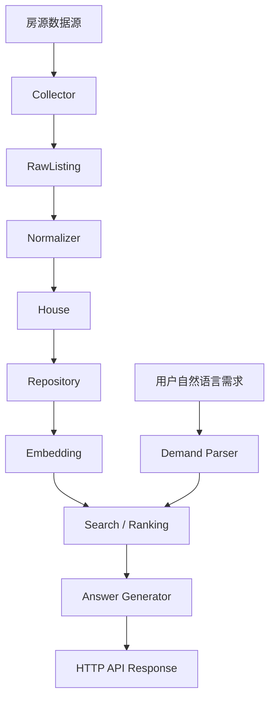

# Architecture

项目主服务位于根目录，核心代码集中在 `app/` 包中。

## Core Modules

| Module | Responsibility |
|---|---|
| `collectors.py` | 接入不同房源数据源，输出统一的原始房源对象。 |
| `normalizers.py` | 清洗原始字段，构建标准房源模型和向量文本。 |
| `repositories.py` | 管理 JSON 文件读写、分页、收藏、历史记录等持久化逻辑。 |
| `demand_parser.py` | 将自然语言需求解析为城市、预算、标签、意图等结构化条件。 |
| `embeddings.py` | 调用 Ollama 或 hash embedding 生成文本向量。 |
| `search.py` | 完成候选过滤、词法评分、语义相似度计算和混合排序。 |
| `answer_generator.py` | 根据推荐结果生成 AI 或模板推荐说明。 |
| `services.py` | 编排采集、入库、检索、收藏、评价和历史服务。 |
| `fastapi_app.py` | FastAPI 接口适配层。 |
| `http_app.py` | 标准库 HTTP 接口适配层。 |

## Data Flow

## Runtime Storage

`storage/` 是运行期数据目录。开源仓库只保留 `.gitkeep`，实际运行后会生成：

- `listings.json`
- `reviews.json`
- `favorites.json`
- `ai_history.json`
- `collection_runs.json`

这些文件属于本地运行数据，不应提交到 GitHub。
